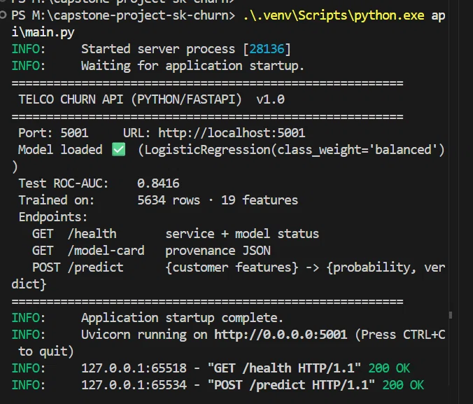
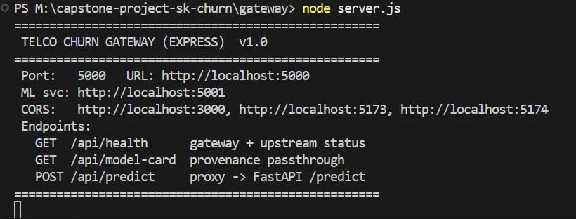
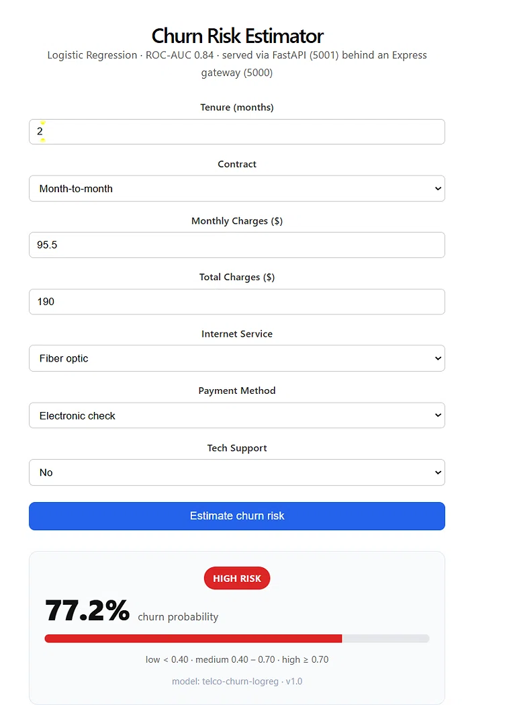
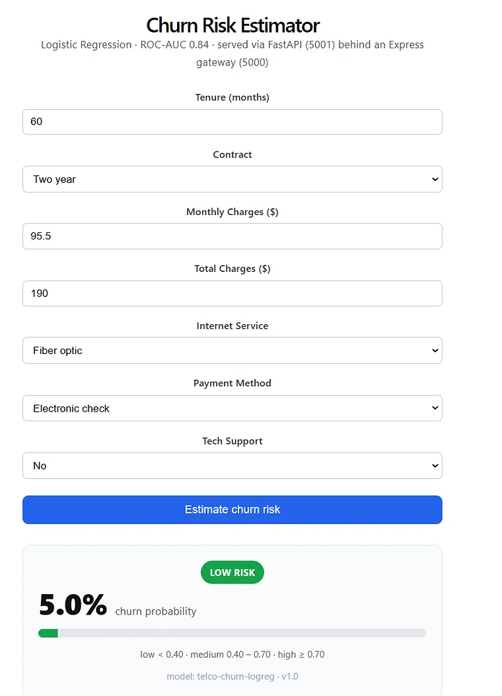

# Telco Customer Churn — ML Capstone

Predict which customers are likely to churn so retention can act early.

**LogisticRegression · ROC-AUC 0.84 · FastAPI (5001) behind an Express gateway (5000) · React widget.**

---

## Problem

A telecom provider loses ~26.5% of its customers to churn. Retention is cheaper than acquisition — but only if the retention team knows *who* to call. This project builds a scoring service that takes a customer's profile and returns a churn probability + a plain-English verdict.

The interesting constraint: churn is a **26.5% positive class**. A model that predicts "no churn" for everyone scores 73.5% accuracy and catches zero churners. So accuracy is a liar here — the project reports ROC-AUC, precision, and recall instead, and explicitly trades precision for recall using `class_weight='balanced'`.

## Data

**IBM Telco Customer Churn** — 7,043 rows × 21 columns, public on Kaggle:
https://www.kaggle.com/datasets/blastchar/telco-customer-churn

Features: 4 numeric (tenure, MonthlyCharges, TotalCharges, SeniorCitizen) · 15 categorical (Contract, InternetService, PaymentMethod, etc.). Target: `Churn` (Yes/No).

Two data quirks handled in the pipeline:
- `TotalCharges` loads as a string, 11 rows fail numeric coercion — all have `tenure=0` (brand-new customers). Fix: `pd.to_numeric(errors='coerce').fillna(0)`.
- `customerID` is 7,043 unique strings — dropped to prevent memorization.

## Model

Three candidates, same preprocessor, same stratified 80/20 split:

| Model                | Accuracy | ROC-AUC  | Precision | Recall   |
|----------------------|----------|----------|-----------|----------|
| **LogReg (winner)**  | 0.7381   | **0.8416** | 0.5043  | **0.7834** |
| XGBoost              | 0.7559   | 0.8365   | 0.5275    | 0.7701   |
| Random Forest        | 0.7708   | 0.8220   | 0.5606    | 0.6310   |

**LogisticRegression won** — the signal here is mostly linear (Contract, tenure, MonthlyCharges), so the tree-based models added variance without insight. The simpler model wins on the metric that matters, so we ship it.

Preprocessing: `ColumnTransformer` (StandardScaler for numerics, OneHotEncoder with `handle_unknown='ignore'` for categoricals) wrapped in a `sklearn.Pipeline`. The pipeline is serialized whole via `joblib` — **no train/serve skew**, since the exact transform that ran during training runs during inference.

**On the class imbalance:** `class_weight='balanced'` trades precision for recall. Recall went from 0.4572 (naive baseline) to 0.7834 — catching 293 of 374 churners instead of 171. For retention, a false positive is a wasted offer; a false negative is a lost customer. That trade is worth it.

## Architecture

```
React widget (5173)
      │  POST /api/predict
      ▼
Express gateway (5000)          ← CORS, envelope, 404 JSON fallback
      │  POST /predict
      ▼
FastAPI ML service (5001)       ← loads model.joblib at startup, Pydantic validation
      │
      ▼
LogisticRegression pipeline     ← same transform at train and serve time
```

**Why a gateway at all?** The React app talks to one origin (5000), so CORS is trivial. The gateway can add rate-limiting or auth later without touching the ML service. If the model is retrained and redeployed, the frontend never notices.

## Evidence

| FastAPI service | Express gateway |
|---|---|
|  |  |

| High-risk customer (77.2%) | Low-risk customer (5.0%) |
|---|---|
|  |  |

Same model, two profiles, 72-point swing. The API is honest — it discriminates.

## How to run

**Prereqs:** Python 3.11+, Node 18+, the Kaggle CSV at `data/raw/WA_Fn-UseC_-Telco-Customer-Churn.csv`.

```powershell
# 1. Setup
python -m venv .venv
.\.venv\Scripts\python.exe -m pip install -r requirements.txt
cd gateway ; npm install ; cd ..
cd frontend ; npm install ; cd ..

# 2. Train (writes model.joblib + model_card.json)
.\.venv\Scripts\python.exe step5_save.py

# 3. Four terminals:
#    T1 — Express gateway
cd gateway ; node server.js
#    T2 — FastAPI ML service
.\.venv\Scripts\python.exe api\main.py
#    T3 — React UI
cd frontend ; npm run dev
#    T4 — smoke test
(Invoke-RestMethod "http://localhost:5000/api/health") | ConvertTo-Json
```

Open **http://localhost:5173** — fill the form, click *Estimate churn risk*.

## Repo layout

```
api/              FastAPI service (port 5001)
gateway/          Express proxy (port 5000)
frontend/         React widget (Vite, port 5173)
data/raw/         CSV (gitignored, see data/README.md)
docs/screenshots/ README images
eda.py            Exploratory data analysis
step2_baseline.py Naive LogReg on numeric-only features
step3_pipeline.py Full pipeline with ColumnTransformer
step4_compare.py  LogReg vs RF vs XGBoost
step5_save.py     Trains winner, saves model.joblib + model_card.json
model_card.json   Model provenance (algorithm, features, metric)
```

## Notes

- **Trained on 2020-era data.** The model reflects that customer base — a real deployment would retrain quarterly on fresh data.
- **No `customerID` in features.** Obviously. But `block`-style IDs are the classic leak in tabular ML — worth flagging.
- **Model card provenance:** see `model_card.json` for the exact algorithm, feature lists, and the split that produced the reported metric.